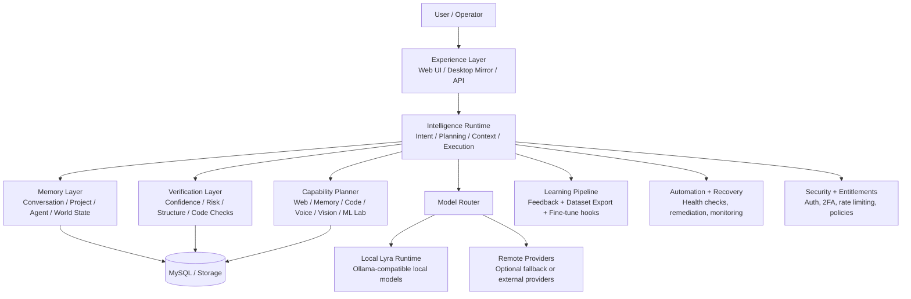

# LyraLink: Architecture and Intelligence Runtime

LyraLink is more than a PHP chat app with a local model attached. It is a layered AI runtime that combines:

- a web and desktop experience layer
- a chat orchestration layer
- a routing and capability selection layer
- memory and retrieval layers
- verification and confidence systems
- agent and project state tracking
- learning and continuous improvement pipelines
- automation, security, billing, and operational health

This README explains how the system behaves as an actual AI runtime, not just a web wrapper around a model.

For where runtime and user artefacts live on disk, and the two separate storage roots this repository has, see [STORAGE.md](STORAGE.md).

## What is LyraLink?

LyraLink is a local-first AI operator platform designed to behave like a controllable runtime rather than a single chatbot. It is built around the idea that a useful AI system must coordinate:

- request understanding
- task planning
- retrieval and context assembly
- model selection
- execution
- verification
- learning
- operational recovery

In practical terms, LyraLink is a system for:

- chat and operator assistance
- technical reasoning and coding support
- retrieval-backed memory and historical context
- task-oriented execution with explicit steps
- bounded autonomy for structured workflows
- local-first inference with optional fallback providers

## High-level architecture



This is intentionally more than a model facade. The intelligence runtime sits between the user and the model and decides what matter is relevant, which subsystem is needed, and what must be verified before the answer is accepted.

## How does intelligence flow through it?

The intelligence pipeline is the core of the architecture.

1. Intake
   - inbound request, session state, plan/entitlements, and current conversation are loaded
2. Intent analysis
   - the system identifies if the request is fast chat, code, reasoning, research, creative, or task-oriented work
3. Capability planning
   - it decides which capabilities are relevant: memory, web, code, vision, voice, or ML tooling
4. Context assembly
   - dataset retrieval, conversation context, and freshness-aware web context are layered in as needed
5. Routing
   - a model/provider route is selected according to task intent and configured defaults
6. Execution
   - the selected runtime executes locally first, with controlled fallback behavior
7. Verification
   - confidence, structure, risk, and optional code-validation checks are performed
8. State updates
   - project state, agent state, memory, and training signals are persisted for future turns

The architecture explicitly follows the pattern:

observe -> hypothesize -> plan -> measure -> verify

That is more important than the model itself. The system is designed to reason about the task before producing an answer.

## What subsystems exist?

LyraLink is composed of several subsystems that are intentionally separate:

- Experience layer
  - web pages, chat surface, and desktop parity runtime
- Chat orchestration layer
  - request intake, routing, execution control, and response assembly
- Routing layer
  - default, fast, code, reasoning, research, and fallback model selection
- Retrieval layer
  - dataset search, document matching, embeddings, and ranking
- Memory layer
  - conversation memory, project state, agent memory, and world-state tracking
- Verification layer
  - confidence scoring, self-verification, hallucination risk, code checks, and operational validation
- Learning layer
  - runtime feedback capture, export pipelines, snapshots, and optional fine-tune execution
- Automation layer
  - health probes, warmup actions, incident handling, and maintenance jobs
- Security and entitlements layer
  - auth, 2FA, rate limiting, secret handling, and access policy
- Billing layer
  - usage, plans, and service-level constraints

## How do those subsystems interact?

The interaction pattern is straightforward but important:

- the chat runtime asks the routing layer which model should handle the request
- the retrieval layer adds contextual memory and evidence when relevant
- the verification layer inspects output before it is accepted as final
- confidence and risk signals feed back into memory and learning
- automation monitors runtime health and can trigger warm-up or remediation actions
- learning consumes both dataset rows and runtime interaction samples
- operators can inspect route posture and health through admin diagnostics

This reduces the common problem of AI systems where model response quality and operational health are disconnected.

## Tool and capability execution

One of the most important architectural ideas in LyraLink is that it does not simply prompt a model and hope for the best. It chooses capabilities.

A typical capability flow looks like this:

```text
Capability Planner
    ↓
Capability Registry
    ↓
Capability Selection
    ↓
Tool / Runtime Action
    ↓
Result Normalization
    ↓
Context Reassembly
    ↓
Model Execution / Final Response
```

Examples of capabilities include:

- web lookup for freshness-sensitive requests
- dataset memory matching for prior domain knowledge
- code validation for generated implementation blocks
- vision for image tasks
- voice or speech-related behavior when relevant
- ML lab actions for training-related prompts

This is the difference between a chatbot and an operator runtime. The runtime decides what kind of work is actually needed before choosing the best execution path.

## What happens when LyraLink receives a complex task?

For a complex task, LyraLink moves into mission mode.

1. The request is interpreted as deeper than a quick factual answer.
2. The capability planner expands to multiple relevant subsystems.
3. The system creates a structured execution plan.
4. The routing layer may escalate to a stronger reasoning route if needed.
5. Memory and retrieval can be added in a way that respects evidence quality.
6. A response is produced with explicit steps and next actions.
7. Verification checks structure, confidence, and risk.
8. State is persisted so the work can continue coherently across turns.

This is why complex requests are treated differently. They are not simple one-shot prompts—they are mini operation flows with context, planning, and verification.

## How does autonomy work?

Autonomy in LyraLink is bounded orchestration, not unrestricted agency.

The system behaves autonomously through:

- capability planning
- persistent agent state
- project tracking
- checkpoints and execution continuity
- high-risk action detection
- role-aware permissions
- explicit verification before finalization

High-risk intents such as deploy, billing, destructive data actions, or key rotation are treated more suspiciously and may require tighter guardrails.

This keeps the platform able to act on goals and tasks without turning into unbounded autonomous behavior with no safety constraints.

## How do agents work?

Agents in LyraLink are not a vague concept—they are stateful execution units with persistence.

The agent layer tracks:

- checkpoint states
- task status
- goals and progress
- performance economy or reward-like state
- recent actions and outcomes
- continuity across turns or sessions

This is important because a task-oriented AI runtime must maintain internal continuity. It cannot simply be a stateless prompt generator.

The agent system stores the working state for:

- project state
- task state
- execution continuity
- progress accounting
- verification outcomes

This is what allows LyraLink to behave as a continuing operator rather than an isolated one-off responder.

## What is the world model?

LyraLink maintains a lightweight world model that tracks:

- projects
- goals
- services and capabilities
- models and providers
- domains and knowledge areas
- timeline and recent events

This world model is updated as tasks are processed and as new evidence is encountered. It is not a full cognitive simulation, but it does give the runtime a persistent set of facts about the user, system, tasks, and environment.

This is one of the key reasons LyraLink feels more like an operating runtime than a simple chatbot.

## How does memory work?

Memory is layered and purpose-specific.

- Retrieval memory
  - approved dataset records are used as prior knowledge and recall anchors
- Conversation memory
  - previous turns and task context inform ongoing response shaping
- Project memory
  - tasks, artifacts, schedules, and project state are maintained over time
- Agent memory
  - checkpoints, execution continuity, and progress state are retained
- World-state memory
  - projects, services, domains, model usage, and recent events are tracked

This layered memory makes the system adaptive without forcing all information into a single monolithic context window.

## How does learning work?

Learning is intentionally conservative.

It has two main sources:

- dataset training samples
  - curated, approved Q/A pairs exported from the dataset layer
- runtime feedback samples
  - actual user interaction pairs with metadata and weights

The learning pipeline then:

1. normalizes data and metadata
2. merges dataset and runtime samples
3. writes full and incremental JSONL exports
4. creates snapshots for traceability
5. optionally executes a fine-tune command when explicitly enabled
6. logs training attempts and outcomes in persistent tables

This is important: no live model mutation happens unless training is explicitly enabled and command-configured.

## How does verification work?

Verification is a core subsystem, not a slogan.

It covers several dimensions:

- response structure validation
  - answers must not be empty, and task-based responses should include structured steps when appropriate
- explicit next-action checks
  - mission tasks should include clear next step guidance
- confidence scoring
  - groundedness, response richness, retrieval use, and error signals all affect confidence
- hallucination risk checks
  - absolute claims without grounding, low confidence, and stale claims are penalized
- code validation
  - generated code can be tested in a sandboxed or host-fallback path
- operational verification
  - maintenance jobs lint the PHP runtime and probe service health

Verification feeds both user-facing quality and learning weight decisions. A sample with stronger verification can carry more weight in future tuning.

## How are models trained, evaluated, and deployed?

### Training

- exports generate full and incremental JSONL corpora
- runtime feedback is weighted based on validation and risk outcomes
- operator-provided tuning commands are executed only under explicit settings

### Evaluation

- route behavior is tested in regression checks
- self-training tests validate model defaults and output quality assumptions
- health monitoring and endpoint probes provide operational signal
- code validation checks generated implementation blocks when needed

### Deployment

- runtime selection is driven by environment configuration
- code defaults are still set at runtime so the system does not silently drift to legacy values
- the desktop web runtime mirrors several core behaviors, though this is a current parity strategy that may eventually be refactored toward a shared core

## How does the system recover from failures?

Recovery is built in at multiple layers:

- model/provider fallback when the primary route fails
- timeout tuning for latency-sensitive tasks and image work
- service health probes and remediation actions
- warm-up actions for local model latency recovery
- incident tracking and status updates for degraded services
- maintenance jobs that can repair or re-index environmental issues

The goal is not to be perfect, but to degrade gracefully, recover automatically where possible, and keep operators informed.

## System boundaries

It is also useful to define what LyraLink owns versus what external systems own.

### LyraLink controls

- orchestration
- routing
- memory persistence
- verification logic
- learning pipelines
- automation routines
- billing and entitlement policy
- auth and access controls
- health and incident reporting

### The model controls

- language generation
- interpretation of prompt structure
- reasoning behavior within the selected model
- structured response synthesis

### External providers control

- remote model execution
- web retrieval sources
- third-party APIs
- hosted services and infrastructure dependencies

This separation matters because it clarifies where responsibility sits. LyraLink manages runtime behavior; the model generates content; external providers provide infrastructure and raw data.

## Current architecture diagram: what it actually means

The runtime is best understood as layers, not as a single linear flow.

```text
User / Operator
      |
      v
Experience Layer
      |
      v
Intelligence Runtime
  - intent analysis
  - capability planning
  - task execution
  - memory updates
  - verification
      |
      +----------------------------+
      |                            |
      v                            v
Model Router                  World State / Memory
      |                            |
      v                            v
Local Lyra                    Retrieval / Dataset
or remote providers           Project and agent state
      |
      v
Verification / Risk / Confidence
      |
      v
Learning + Automation + Health
```

This is the actual architecture the code is approaching: not a chatbot with a model attached, but a runtime that reasons, plans, verifies, persists, and adapts.

## Current implementation notes

A few implementation realities matter for understanding the codebase:

- the application keeps a web runtime and a desktop runtime mirror for parity
- the route defaults and embedding defaults are normalized to avoid fallback drift
- health endpoints expose runtime routing posture to the admin surface
- the system is designed for observability and controlled fallback, not hidden behavior

This is a healthy architecture choice for a product that is becoming more operationally sophisticated.

## Suggested reading order

For a developer who wants to understand the system in depth, the recommended order is:

1. api/chat.php
2. api/lib/chat/llm_routing.php
3. api/lib/chat/runtime_core.php
4. api/lib/chat/intelligence_layer.php
5. api/lib/chat/execution_foundation.php
6. api/dataset_search.php
7. cron/auto_maintenance_runner.php
8. cron/continuous_model_learning.php
9. tests/self_training_test.php
10. tests/embed_defaults_test.php

## Summary

LyraLink is a layered AI operator runtime whose real value is not the model alone, but the orchestration around it:

- it understands requests
- plans capabilities
- uses memory and retrieval appropriately
- routes to the right model
- verifies output
- persistently tracks work
- learns from runtime and dataset signals
- recovers from failure gracefully

That is what makes it a real AI runtime instead of a basic prompt-and-response app.

This README is intended to be the architectural map; deeper operational details belong in the wiki and subsystem docs.
